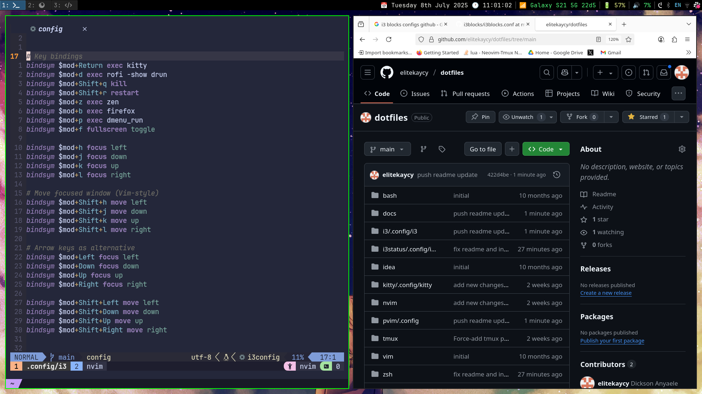

# Dotfiles

Minimal, high-productivity dotfiles for i3 + kitty + tmux + zsh + neovim.



## Quick Install

```bash
git clone --recurse-submodules https://github.com/elitekaycy/dotfiles.git ~/dotfiles
cd ~/dotfiles
./install.sh
```

This will:
- Install all dependencies (i3, kitty, tmux, zsh, neovim, etc.)
- Install JetBrains Mono Nerd Font
- Symlink all configs via stow
- Set zsh as default shell

**Supported distros:** Debian/Ubuntu, Fedora, Arch Linux

## Manual Install

If you prefer to install specific components:

```bash
./install.sh core       # git, stow, curl, etc.
./install.sh i3         # i3wm, i3blocks, rofi, dmenu, feh, flameshot, etc.
./install.sh terminal   # kitty, tmux, zsh
./install.sh devtools   # bat, fd, fzf, eza, ripgrep, btop
./install.sh fonts      # JetBrains Mono Nerd Font
./install.sh stow       # Symlink dotfiles only
./install.sh pvim       # Setup neovim (pvim config)
```

## What's Included

| Config | Description |
|--------|-------------|
| **i3** | Tiling WM with named workspaces, floating toggles, vim-style navigation |
| **kitty** | GPU-accelerated terminal with Catppuccin theme |
| **tmux** | Terminal multiplexer with vim bindings, TPM plugins |
| **zsh** | Shell with znap, pure prompt, autosuggestions, syntax highlighting |
| **pvim** | Neovim config with LSP, treesitter, lazy.nvim |

## Keybindings

### i3

| Key | Action |
|-----|--------|
| `Mod+Return` | Open terminal (kitty) |
| `Mod+d` | Rofi launcher |
| `Mod+b` | Firefox |
| `Mod+Shift+q` | Kill window |
| `Mod+h/j/k/l` | Focus left/down/up/right |
| `Mod+Shift+h/j/k/l` | Move window |
| `Mod+1-0` | Switch workspace |
| `Mod+Shift+u` | Toggle Slack |
| `Mod+Shift+i` | Toggle Spotify |
| `Mod+Shift+o` | Toggle Obsidian |
| `Mod+Shift+p` | Toggle floating terminal |
| `Mod+Shift+;` | Toggle btop |
| `Mod+Shift+s` | Screenshot (flameshot) |

### tmux

| Key | Action |
|-----|--------|
| `Ctrl+a` | Prefix (instead of Ctrl+b) |
| `Prefix + =` | Split vertical |
| `Prefix + -` | Split horizontal |
| `Alt+H/L` | Previous/next window |

## Dependencies

Auto-installed by `install.sh`:

- **Window Manager:** i3, i3blocks, rofi, dmenu, feh, picom
- **Terminal:** kitty, tmux, zsh
- **Editor:** neovim
- **Tools:** bat, fd, fzf, eza, ripgrep, btop, flameshot, redshift
- **Fonts:** JetBrains Mono Nerd Font

## Submodules

```bash
git submodule update --init --recursive
```
