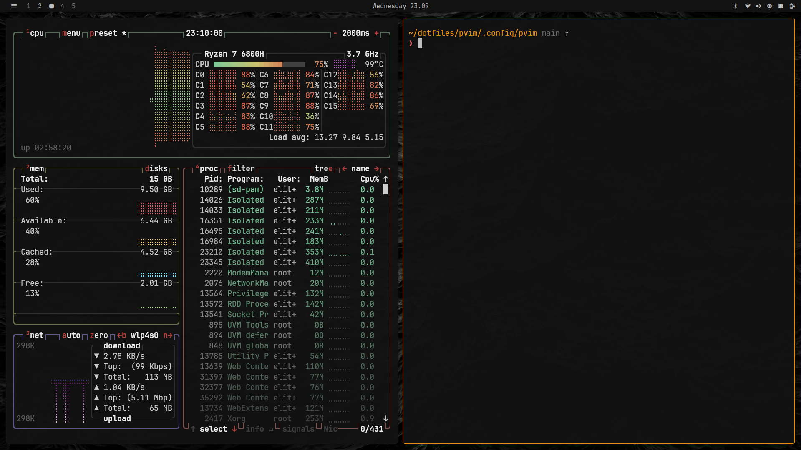

# elitekaycy/dotfiles

[](https://github.com/elitekaycy/dotfiles/actions/workflows/verify.yml)

My i3 workstation: i3 + Polybar + Rofi + Kitty + tmux + Zsh + Neovim (pvim), themed from one source and driven by a small set of `dots-*` commands. Built for me, kept lean.



## How it fits together

```text
themes/<id>.conf  ──►  dots-theme-set  ──►  polybar · kitty · dunst · rofi · i3 · tmux · pvim · wallpaper · lock · login
                            ▲
   Mod+t / Mod+Ctrl+Shift+Space ── dots-theme-menu (rofi)
   Mod+Ctrl+t ──────────────────── dots-theme-next
   Mod+Alt+Space ───────────────── dots-menu (hub: apps, theme, wallpaper, sessions, wifi, bluetooth, …)
```

- **One theme source** (`themes/.config/themes/themes/<id>.conf`) defines ~20 colours. `dots-theme-set` renders every app template from it and reloads the desktop. Nothing is hardcoded per app.
- **Per-theme wallpapers** live in `wallpapers/<theme-id>/`; `wallpapers/shared/` works with any theme. Switching theme switches wallpaper; `Mod+Ctrl+Space` cycles within the theme.
- **Lock and login match the theme.** `dots-lock` is i3lock-color (blurred desktop, clock, ring in the theme colours); the login screen is SDDM + [sddm-astronaut-theme](https://github.com/Keyitdev/sddm-astronaut-theme), re-rendered by `dots-login-sync` with the theme colours and the current wallpaper on every switch.
- **Every picker is Rofi** and every action is a `dots-*` command, so i3, Polybar and the shell all call the same thing.
- **Stow deploys** each package without folding directories; generated files are user state, never committed.

## Install

```bash
git clone --recurse-submodules https://github.com/elitekaycy/dotfiles.git ~/dotfiles
cd ~/dotfiles
./install.sh            # full workstation (Ubuntu/Debian, Fedora, Arch)
```

Conflicting unmanaged files are moved (never deleted) to `~/.local/state/dotfiles/backups/<timestamp>/`. Log out after the first full install.

| Component | What it does |
| --- | --- |
| `./install.sh stow [--dry-run]` | Reconcile config symlinks only |
| `./install.sh setup` | Links, wallpapers, theme, TPM plugins, pvim |
| `./install.sh themes` | Render the saved theme (Tokyo Night on first use) |
| `./install.sh wallpapers` | Copy `wallpapers/` into `~/Pictures/wallpapers/` |
| `./install.sh core` / `i3` / `terminal` / `fonts` / `zsh` | System packages by area (`i3` also builds i3lock-color) |
| `./install.sh login` | SDDM + astronaut login screen; replaces GDM/LightDM, active after reboot |
| `./install.sh devtools` / `languages` | Everything in the mise manifest |
| `./install.sh docker` / `chrome` / `rust` / `nvidia` / `greenclip` / `slack` / `media` | Optional extras |
| `./install.sh check` | Run the verification suite, change nothing |

## Update

```bash
./update.sh                          # fast-forward, verify, restow, re-render theme, mise + TPM
./update.sh --local                  # skip git; apply the current checkout
./update.sh --local --configs-only   # links + theme + wallpapers only, no tool sync
./update.sh --check                  # fetch + verify, deploy nothing
```

A dirty checkout is never reset, rebased or stashed; it is deployed as-is and the command exits `2`.

## Commands

All live in `bin/.local/bin/` and are on `PATH` as `~/.local/bin/dots-*`.

| Command | Does |
| --- | --- |
| `dots-menu` | **The search.** Every system action and every app in one rofi list. Type `shutdown`, `brightness`, `wifi`, `volume`, `theme`, `firefox`… Enter runs it. Hidden keywords match too (`poweroff`, `dim`, `screen`, `sleep`) |
| `dots-actions` | The action list behind `dots-menu` (rofi script mode); add a row there to add a searchable action |
| `dots-brightness up\|down\|<percent>` | Screen brightness with an on-screen bar |
| `dots-power [lock\|logout\|suspend\|hibernate\|reboot\|shutdown]` | Power menu, or jump straight to one action (destructive ones confirm) |
| `dots-theme-menu` | Rofi theme picker; type a name or `dark` / `light` to filter |
| `dots-theme-set [--no-reload] <id>` | Render + apply a theme (`dots-theme-set nord`) |
| `dots-theme-next` | Cycle to the next theme |
| `dots-theme-current` | Print the selected theme id |
| `dots-bg-menu` | Rofi wallpaper picker (current theme first, then `shared/`, then the rest) |
| `dots-bg-next` | Next wallpaper within the current theme + `shared/` |
| `dots-bg-set [path]` | Set a wallpaper on every monitor; no arg restores the last one |
| `dots-session <name>` / `--menu` | Create/attach tmux session `main`, `work`, `scalestash`, or any name; `--menu` picks in Rofi |
| `dots-keys` | Searchable list of every i3 keybinding |
| `dots-wifi` / `dots-bluetooth` | Rofi network menus (also opened by clicking the Polybar modules) |
| `dots-screenshot area\|full\|clip` | Flameshot |
| `dots-lock` | Lock: blurred desktop, clock and ring in the theme colours (i3lock-color; plain i3lock fallback) |
| `dots-login-sync` | Re-render the SDDM login screen from the theme + current wallpaper (run automatically on theme/wallpaper change) |

## Themes

Available: `matte-black` (darkest, Omarchy palette) `nebula` (JWST Tarantula Nebula) `tokyo-night` `tokyo-night-light` `catppuccin-mocha` `catppuccin-latte` `dracula` `gruvbox-dark` `gruvbox-light` `nord` `nord-light`

What one theme drives:

| App | Rendered file | How it is picked up |
| --- | --- | --- |
| Polybar | `~/.config/polybar/config.ini` | bar restarted |
| Kitty | `~/.config/kitty/theme.conf` | `include theme.conf`; live via remote control |
| Dunst | `~/.config/dunst/dunstrc` | daemon restarted |
| Rofi | `~/.config/rofi/config.rasi` | next launch |
| i3 | `~/.config/i3/theme.conf` | `include` in i3 config; `i3-msg reload` |
| tmux | `~/.config/tmux/theme.conf` | `source-file` in `.tmux.conf`; live reload |
| pvim | `~/.local/share/nvim/pvim_theme.txt` | read on startup |
| Lockscreen | — | `dots-lock` reads the theme colours at lock time |
| Login (SDDM) | `/usr/share/sddm/themes/sddm-astronaut-theme/Themes/dotfiles.conf` + `Backgrounds/dotfiles/` | user-owned slots written by `dots-login-sync`; shown at next login |
| Wallpaper | `~/.config/current-wallpaper` | first file in `wallpapers/<id>/` unless the current one already belongs to the theme |

Selected id: `~/.local/state/dotfiles/theme`.

### Add a theme

1. Copy `themes/.config/themes/themes/tokyo-night.conf` to `<id>.conf` and set `THEME_NAME`, `THEME_TYPE` (`dark`/`light`), `NVIM_THEME`, and the colours.
2. Put one or more wallpapers in `wallpapers/<id>/`.
3. `./update.sh --local --configs-only`, then `Mod+t`.

Templates are in `themes/.config/themes/templates/`; edit one when *every* theme should render a new setting. Placeholders: `{{BG}} {{BG_HEX}} {{BG_ALT}} {{FG}} {{FG_DIM}} {{PRIMARY}} {{SECONDARY}} {{ACCENT}} {{RED}} {{GREEN}} {{YELLOW}} {{BLUE}} {{MAGENTA}} {{CYAN}} {{WHITE}} {{BLACK}} {{THEME_NAME}} {{THEME_TYPE}}`. `sddm.template` additionally gets `{{LOGIN_BACKGROUND}}` (the wallpaper copied into the theme).

### Lock and login screens

- **Lock** (`Mod+Escape`, suspend via `xss-lock`): `dots-lock` runs `i3lock-color` with a blurred screenshot, a clock inside a ring indicator and `user@host` below it, all in the active theme's colours. `./install.sh i3` builds it as `/usr/local/bin/i3lock-color`; without it, `dots-lock` falls back to the distro `i3lock` in the theme background colour.
- **Login**: `./install.sh login` installs SDDM and clones the astronaut theme (pinned to its last Qt5 release on Debian/Ubuntu, whose `sddm-greeter` is Qt5, and to its last pre-`QtQuick.Effects` release on Fedora/Arch) into `/usr/share/sddm/themes/`, points it at `Themes/dotfiles.conf`, makes that file and `Backgrounds/dotfiles/` user-owned, and enables `sddm.service` in place of GDM. From then on `dots-login-sync` (called by `dots-theme-set` and `dots-bg-set`) rewrites the login colours and copies the current wallpaper there, so the login screen always matches the desktop. Reboot once after installing.

## Wallpapers

```text
wallpapers/
├── tokyo-night/        # used when tokyo-night is active
├── nord/ …             # one directory per theme id
└── shared/             # offered with every theme (lofi-*, an.jpg)
```

`./install.sh wallpapers` copies the tree to `~/Pictures/wallpapers/` additively, so machine-local extras dropped there survive updates. `Mod+Shift+b` lists everything; `Mod+Ctrl+Space` cycles the current theme's set.

## Secrets

Secrets are managed by [`pass`](https://www.passwordstore.org/): one GPG-encrypted file per secret under `~/.password-store/`, versioned with git. `./install.sh pass` installs it, creates a GPG key if you have none (asks for a passphrase once; the agent then caches it for 8h), and initialises the store.

Until that step has been run, `dots-secret` transparently uses the GNOME keyring instead (already running, unlocked by your login, nothing to set up). `dots-secret backend` tells you which one is active; the commands are identical.

```bash
dots-secret set aws/sandbox          # prompts for the value (or pipe it in)
dots-secret get aws/sandbox          # print (first line)
dots-secret copy aws/sandbox         # clipboard, cleared after 45s
dots-secret gen github/token 40      # generate + store
dots-secret edit aws/sandbox         # multi-line: secret on line 1, notes below
dots-secret ls | find aws | grep txt # list, search names, search contents
dots-secret rm aws/sandbox
dots-secret sync                     # git pull + push (after: pass git remote add origin <private repo>)
export OPENAI_API_KEY="$(dots-secret get openai)"   # in scripts / .envrc
```

Search `secret` in `Mod+Alt+Space` to pick one and copy it. Plain `pass` commands work on the same store.

## Dark mode and browser

Everything is dark by default: GTK 3/4 (`gtk/` package: Adwaita-dark, Papirus-Dark icons), the desktop portal (`portals.conf` → gtk, which is how browsers learn the colour scheme under i3), and every Zen/Firefox profile (`dots-darkmode` writes a `user.js` forcing dark UI *and* dark web content). Re-run `dots-darkmode` after creating a new browser profile.

Browser: **Zen** (`Mod+z`), Firefox-based with built-in split view, compact mode and workspaces. `./install.sh zen` drops an enterprise policy into `/opt/zen/distribution/` that installs **Vimium** automatically: `f` to hint-click links, `o` to search/open, `J`/`K` tabs, `/` find, `gg`/`G`, `H`/`L` back/forward. For a heavier, fully vim-modal setup swap Vimium for Tridactyl in `install/zen-policies.json`.

## Monitors

Layouts are remembered **per set of connected outputs** in `~/.config/monitors/<outputs>.sh` (e.g. `eDP-1-2+HDMI-0.sh`, plain xrandr, editable).

- Plug a monitor in → the saved layout for that combination is applied; if none exists, laptop screen primary with the others to its right.
- Arranging with arandr (or xrandr) is never undone: the watcher only re-applies layouts on hotplug, and restarts Polybar on any geometry change.
- Search `monitors` in `Mod+Alt+Space`: **arrange** (opens arandr and saves when it closes), **save layout**, **reset layout**.

```bash
dots-monitors save      # remember the current layout for these outputs
dots-monitors apply     # what i3 and the hotplug watcher run
dots-monitors arrange   # arandr, then save
dots-monitors forget    # back to the default arrangement
```

## Keybindings

`Mod` = Super. Shown live with `Mod+Shift+/` (`dots-keys`).

### Launchers and menus

| Key | Action |
| --- | --- |
| `Mod+Return` | Kitty |
| `Mod+d` | Rofi app launcher |
| `Mod+Alt+Space` | **Search everything** — actions + apps (`dots-menu`) |
| `Mod+v` | Clipboard history (greenclip) |
| `Mod+Shift+/` | Keybinding reference |
| `Mod+z` / `Mod+b` | Zen browser / Firefox |
| `Mod+m` | ncspot |
| `Mod+Shift+a` / `Mod+Shift+v` | ani-cli / lobster |
| `Mod+Shift+w` | tmux session `work` |
| `Mod+Shift+t` | tmux session `scalestash` |

### Theme and wallpaper

| Key | Action |
| --- | --- |
| `Mod+t` or `Mod+Ctrl+Shift+Space` | Theme picker |
| `Mod+Ctrl+t` | Next theme |
| `Mod+Shift+b` | Wallpaper picker |
| `Mod+Ctrl+Space` | Next wallpaper (current theme) |

### Windows and workspaces

| Key | Action |
| --- | --- |
| `Mod+h/j/k/l` or arrows | Focus left/down/up/right |
| `Mod+Shift+h/j/k/l` or `Mod+Shift+arrows` | Move window |
| `Mod+1…0` / `Mod+Shift+1…0` | Go to / move to workspace 1…10 |
| `Mod+a` / `Mod+-` | Split vertical / horizontal |
| `Mod+s` / `Mod+w` / `Mod+e` | Stacking / tabbed / toggle split |
| `Mod+=` | Toggle split layout |
| `Mod+f` | Fullscreen (hides the bar) |
| `Mod+Shift+m` | Maximize but keep the bar: no gaps/borders on this workspace (toggle) |
| `Mod+Shift+Space` | Toggle floating |
| `Mod+Space` | Focus tiling ↔ floating |
| `Mod+c` | Centre floating window |
| `Mod+Shift+q` | Close window |
| `Mod+Shift+r` | Restart i3 |

### System

| Key | Action |
| --- | --- |
| `Mod+Escape` | Lock |
| `Mod+Shift+s` / `Mod+Shift+f` / `Mod+Shift+c` | Screenshot area / full / area→clipboard |
| `XF86 brightness / volume / media keys` | brightnessctl, pactl, playerctl |

Polybar (icons only, left → right): `≡` menu (click: `dots-menu`, right-click: Kitty) · workspaces 1–5 always, 6–10 when used (dot = active, click to switch) · clock (click: `dots-menu`) · tray · bluetooth (`dots-bluetooth`) · wifi (`dots-wifi`) · audio (click: `pavucontrol`, right-click: mute, scroll: volume) · cpu (`btop`) · battery (`dots-power`).

### tmux (prefix `Ctrl+g`)

| Key | Action |
| --- | --- |
| `Ctrl+g p` then `n/r/l/u/d` | Split right/right/left/up/down in the current directory |
| `Ctrl+g t` then `n/h/l` | New window / previous / next |
| `Ctrl+h/j/k/l` | Move between panes and Neovim splits |
| `Alt+H` / `Alt+L` | Previous / next window |
| `Ctrl+g [` | Copy mode (vi keys; `v` select, `y` yank) |

Shell: `tn <name>` new, `ta <name>` attach, `tl` list, `tk <name>` kill.

## Repository layout

```text
.
├── install.sh / update.sh        # entry points
├── install/                      # package installers, Stow deployer (DOTFILES_PACKAGES), setup steps
├── scripts/verify.sh             # local + CI verification
├── tests/                        # temp-HOME integration tests
├── bin/.local/bin/dots-*         # all commands
├── themes/.config/themes/        # themes/<id>.conf + templates/<app>.template
├── wallpapers/<theme-id>/        # per-theme wallpapers, plus shared/
├── i3/  polybar/  kitty/  tmux/  picom/  zsh/  bash/  git/  mise/  broot/  vim/  idea/  nvim/
└── pvim/.config/pvim/            # Neovim config (git submodule)
```

Generated and untracked: `polybar/config.ini`, `kitty/theme.conf`, `dunst/dunstrc`, `rofi/config.rasi`, `i3/theme.conf`, `tmux/theme.conf`, `nvim/lazyvim.json`.

## Verify before committing

```bash
./scripts/verify.sh
```

Conventions and commit rules: [`CLAUDE.md`](./CLAUDE.md).

## Troubleshooting

- Theme looks half-applied → `dots-theme-set $(dots-theme-current)`; check `~/.config/<app>/theme.conf` exists.
- Wallpaper missing after a theme switch → `./install.sh wallpapers` (the theme directory in `~/Pictures/wallpapers/` is empty).
- A `dots-*` command is missing → `./install.sh stow`.
- Login screen not themed → `dots-login-sync` (needs `./install.sh login` first); the font is `JetBrainsMono Nerd Font` copied to `/usr/local/share/fonts/`.
- Lock screen is a flat colour → i3lock-color is missing: `./install.sh i3`.
- Restore an overwritten file from `~/.local/state/dotfiles/backups/`.
- `./update.sh` exits `2` → local changes were preserved and upstream sync skipped; commit and rerun.

## License

[MIT](./LICENSE)
